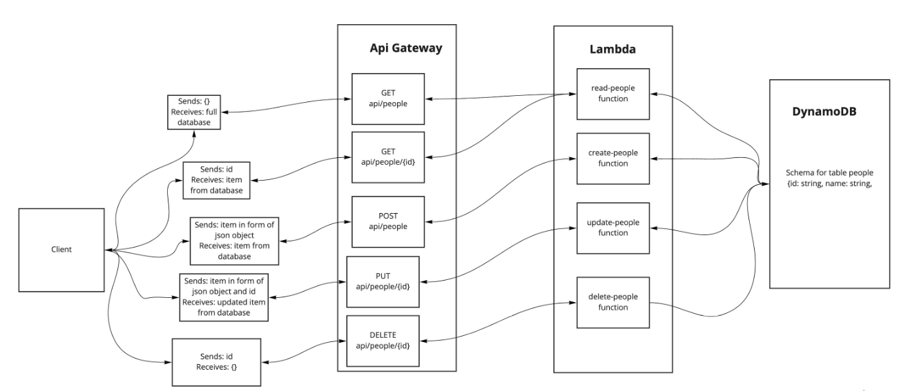

# serverless-api

## Github PR

[Github Pull request](https://github.com/ibrahimAbuawad/serverless-api/pull/1)

## Github Actions

[Actions](https://github.com/IbrahimAbuawad/serverless-api/actions)
## API Gateway URL

[API Gateway URL](https://dunu1cze4f.execute-api.us-east-1.amazonaws.com/people)

## UML

## Class notes
* Learn how to use DynamoDB and dynamoose
* Learn how to use AWS API Gateway
* Learn how to integrate DynamoDB, Lambda, and API Gateway
* Learn how to test deployed serverless API